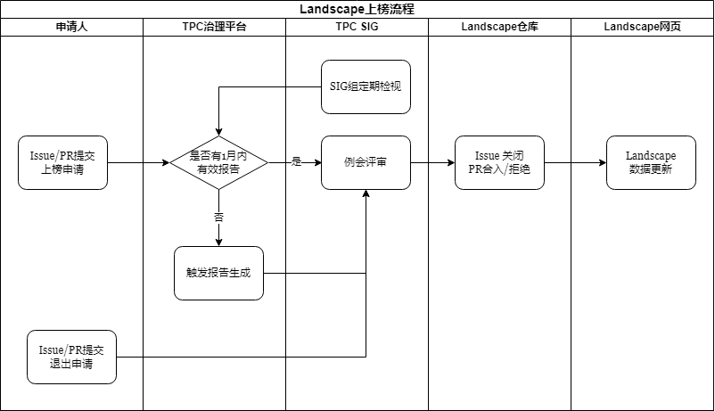

# OpenHarmony TPC Landscape
OpenHarmony TPC Landscape 全称为 OpenHarmony Third-Party software Component Landscape（OpenHarmony三方组件全景图）, 主要面向OpenHarmony社区及开源鸿蒙应用开发者提供相关三方库项目全景图，为用户提供三方库生态概览，支撑关键技术选型需求。

## 目的
OpenHarmony 三方组件全景图整合和展示OpenHarmony生态系统中三方组件库和专有应有，按照技术领域、成熟度分类，为用户建立简洁、清晰、准确的生态组件概览。全景图旨在帮助社区和应用开发者快速定位组件资源，降低选型和开发成本并提升开发体验，促进OpenHarmony生态系统的发展和应用。

## 三方库介绍
OpenHarmony三方库使用**ArkTS**作为官方编程语言，同时提供C/C++、TS/JS等语言支持，已有开源项目可快速适配实现对开源鸿蒙操作系统的支持。OpenHarmony三方库项目均为已完成开源鸿蒙操作系统支持的开源项目，其主要来源及鸿蒙化形式为：**Java库的ArkTS重写**、**JS/TS适配(部分代码嵌入式修改)**、**C/C++移植（编译设置调整）**和**OpenHarmony原创**。  
三方库项目遵循**上游优先**原则，对于鸿蒙化支持特性优先回合上游社区，但受限于上游社区、项目维护策略，对于因复杂因素导致特性无法合入上游项目，由新增特性开发组织、团队、开发者负责维护，社区给予能力支持。同时，OpenHarmony社区积极欢迎开源项目启动鸿蒙化适配并完成成熟度验证，共建OpenHarmony生态。    
三方库项目使用统一命名规则，仓库命名统一为ohos_软件名称，其中软件名称应与其官网保持一致，禁止使用软件的子模块作为软件名。

### 技术领域分类
OpenHarmony 三方组件按照北向（应用开发）、南向（硬件交互）进行场景区分，其中在每个场景中根据三方库提供能力按照技术领域实施二级分类进行项目管理。  
北向三方库组件主要技术领域二级分类如下表：
| 一级类别 | 二级类别 | 
|:-------:|:-------:|
| 框架 | RN框架（React Native) |  
| 框架 | Flutter框架（Flutter） |
| 媒体 | UI |
| 媒体 | 动画 |
| 媒体 | 音视频 |
| 媒体 | 图片 |
| 算法 | 人工智能 |
| 算法 | 数学及算法 |
| 算法 | 图形 |
| 算法 | 加解密 |
| 应用开发 | 工具 |
| 应用开发 | 架构及模式 |
| 应用开发 | 日志及调试 |
| 应用开发| 辅助实用 |
| 数据 | 数据库 |
| 数据 | 文件及解析 |
| 网络协议 | 网络及协议 |  

**TODO**:南向三方库技术领域分类输出

### 成熟度分类
OpenHarmony社区对于三方库组件根据其开源社区和软件制品的成熟度评估分为孵化项目、毕业项目和发行版项目，三种成熟度软件质量喝社区质量依次递增。

#### 成熟度定义与特征
在项目成熟度分类中，针对不同阶段项目，根据其特点采取相应的开源治理措施：对于孵化项目加强质量管控、鼓励社区参与；毕业项目维持稳定并促进社区生态壮大；发行版项目注重规模化使用支持、长期规划、风险管理以及推动整个生态系统的发展，确保项目的长期可持续性和影响力。各阶段项目特点及管理重点详情如下：

**孵化项目**：
* 定义：孵化项目处于发展阶段，通常表现为功能不完备、代码质量待提升、缺乏广泛的用户基础和社区支持；
* 特征：可能存在功能不完善、文档缺失、代码质量低下等问题；
* 治理特点：通常由较小的核心团队维护，社区规模较小，需建立更多的社区参与机制；
* 关注重点：重点在于建立良好的社区治理结构，促进贡献者参与，加强项目可持续性；需关注代码审查、测试覆盖率、文档完整性等方面的提升；

**毕业项目**：
* 定义：毕业项目意味着项目已具备一定的成熟度和可靠性，在社区生态和质量方面满足要求；
* 特征：具备完善的文档、稳定的功能、高质量的代码基础、有较多的用户基础和积极的社区生态支持；
* 治理特点：社区规模逐渐增大，拥有成熟的治理结构和决策机制；
* 关注重点：持续维护项目的稳定性、安全性，推动社区生态的发展，保持和增强社区的活跃度和多样性，确保代码质量和安全性，提供稳定的版本发布周期和兼容性保证；

**发行版项目**：
* 定义：成熟的核心项目，被广泛用于生产环境，并且其他项目或组织依赖其稳定性和功能；
* 特征：具备高度稳定性、安全性、可靠性，并受到产业界广泛认可；
* 治理特点：拥有成熟的治理结构、社区活跃度高，能够快速响应用户需求和安全漏洞；
* 关注重点：重点在于保持高水平的代码质量、稳定性和兼容性，及时响应漏洞和需求，推动项目的长期发展和创新；

#### 成熟度检查指标及要求

**孵化项目**阶段涉及检查项及评分规则见下表，其中**风险是否必须澄清**表明在项目成熟度认证中，如果相关指标得分低于6分（满分10分）则需由项目负责人/申请人提交澄清说明并经过相关认证责任人对澄清进行审核和确认： 

| **维度** | **指标名称** | **重要性** | **风险是否必须澄清** | **指标意义** | **检查/评分规则** |
|------|------|------|------|------|------|
| 基本信息 | 适配仓库命名 | 低 | N/A | 仓库名需满足社区要求以便统一管理 【规则】 1. 仓库命名统一为ohos_软件名称，其中软件名称和其官网保持一致； 2. 禁止以软件的子模块作为软件名； | 不设置评分，仅检查是否满足。 |
| 基本信息 | 源码地址 | 低 | N/A | 软件官方源码下载地址 【规则】 1.. 提供软件版本的官方源代码包下载地址，保证可溯源； | 不设置评分，仅检查是否满足。 |
| 网络安全 | 二进制制品 | 高 | 是 | 软件源码仓库是否包含二进制制品 【建议】 不建议二进制引入，应从源码构建。如必要引入须在TPC SIG决策，并提供构建指导； | 设置评分。满足10分，不满足0分。 |
| 生命周期 | 软件功能归一 | 高 | 是 | 同功能软件只在OpenHarmony及TPC中引入一款 【规则】 1. 主动选型开源软件与被动依赖开源软件同功能软件只在OpenHarmony及TPC中引入一款，避免重复引入； | 不设置评分，仅检查是否满足。 |
| 合法合规 | 许可证包含 | 高 | 是 | 软件许可证合规性检查 【规则】 1. 禁止选用无许可证、许可证不是开源促进会OSI批准的开源许可证的软件； 【建议】 1. 选择软件本身许可证（含项目级和文件级）及其依赖软件许可证均为宽松类型许可证的软件； 2. 项目的所有源码包含许可头与版权声明； | 设置评分。许可证是OSI批准的，且宽松型许可证10分，弱宽松型许可证8分，非宽松型许可证6分；无项目级许可证或许可证不是OSI批准的开源许可证0分； |
| 合法合规 | DCO | 中 | 否 | 软件代码提交者原创性声明签署检查 【建议】 1. 项目的提交者应签署DCO; | 设置评分。项目所有贡献者签署DCO 10分，部分签署8分，无人签署6分。 |
| 合法合规 | 许可证兼容性 | 高 | 是 | 软件许可证兼容性检查 【规则】 1. 禁止引入项目级、文件级License存在兼容性问题的软件及版本 | 设置评分。软件项目级、文件级许可证存在兼容性问题0分，无兼容性问题10分。 |
| 技术生态 | 依赖可获得 | 高 | 是 | 软件依赖源码可获得检查 【规则】 1. 项目依赖的库必须是开源软件，可公开获得。 | 设置评分。软件依赖的库是开源软件10分，依赖软件非开源软件0分。 |
| 技术生态 | 代码维护 | 高 | 否 | 社区活跃度及是否活跃维护检查 【规则】 1. 选用成熟期（代码更新活跃，定期发布）或成长期（代码更新活跃，频繁发布）的软件，禁止选用处于衰退期（代码无更新或无新版本发布）的软件； | 设置评分。采用OSS-Compass最近一年活跃度模型平均得分，得分范围0-10分。|
| 技术生态 | 适配方式 | 高 | 是 | OH TPC适配方式及引入成本评估。 【建议】 优先采用“JS/TS适配”、“C/C++库移植”方式引入TPC软件；不建议采用“仅作为实现参考”、“Java库重写”方式引入； | 设置评分。JS/TS适配 10分，C/C++库移植 10分，仅作为实现参考8分，Java库重写 6分。 |
| 技术生态 | 社区支撑 | 高 | 否 | 社区服务与支撑检查 【建议】 1. 社区无明确版本计划，有效bug、PR半年以上未响应不建议选用； | 设置评分。采用OSS-Compass最近一年社区服务与支撑模型平均得分，得分范围0-10分。 |
| 生命周期 | 版本生命周期 | 高 | 是 | 检查软件版本社区维护生命周期是否结束 【建议】 1. 优先选择2年以内发布的版本（以评审节点计算）； 2. 社区已经EOL的版本，不建议引入； | 设置评分。最近2年内有版本发布10分，版本发布超过2年6分，没有发布任何版本4分，仓库已归档0分。 | 
| 网络安全 | 安全漏洞 | 高 | 是 | 检查软件及依赖源码是否有公开未修复漏洞 【规则】 1. 禁止选用含非误报病毒告警的软件（含被动依赖软件）； 2. 禁止选用含已知未修复漏洞软件； | 设置评分。无公开未修复漏洞10分，有公开未修复漏洞0分； |
| 网络安全 | 漏洞响应机制 | 高 | 否 | 软件漏洞响应机制检查 【规则】 1. 选用开源软件必须有漏洞反馈与修复跟踪管理机制； | 设置评分。检查漏洞响应链接（默认使用Issue作为响应方式）是否可用，满足10分，不满足6分。 |
| 技术生态 | 采用度分析 | 中 | 否 | 软件采用度分析，优选在业界广泛应用软件 【建议】 1. 优选主流的供应商/社区或社区项目； 2. 优选在业界成熟应用或产品实际使用效果好的软件； | 设置评分。 评分细则待定 |
| 技术生态 | 软件质量 | 中 | 否 | 软件质量分析，包含代码规范，圈复杂度，代码复用度，测试用例覆盖度 【规则】 1. 不符合技术架构与技术演进淘汰的软件禁止引入； 【建议】 1. 技术架构优选更安全、灵活度高、支持组件化、插件化的软件； 2. 优选代码质量高的软件，如使用不安全函数数量/密度少、代码结构规范（圈复杂度低）、重复度低、代码调试功能可关闭、有自动化构建能力、自动化测试充分； | 设置评分。最终得分 = avg(代码重复率得分  + 测试覆盖率得分) 代码重复率评分: 0% - 2%   => 10分 3% - 4%   => 8分 5% - 9%   => 6分 10% - 19% => 4分 20% - 99% => 2分 100%      => 0分 测试覆盖率评分: 80% - 100% => 10分 70% - 79%  => 8分 50% - 69%  => 6分 30% - 49%  => 4分 1% - 29%   => 2分 0%         => 0分 |
| 技术生态 | 专利风险 | 中 | 否 | 软件专利风险分析 【建议】 1. 优先选择全球专利保护社区OIN（Open Invention Network）认证软件，未认证软件需单独审视专利风险； | 设置评分。 评分细则待定  |
|    |

**毕业项目**阶段涉及检查项及评分规则见下表，该阶段涉及检查指标得分规则普遍为达标10分，未达标0分，从而更好对毕业项目质量进行管控，特殊指标如许可证包含（涉及非宽松型License使用）和代码质量（代码复杂度、测试覆盖率等）设置中间得分由相关评审人员确认是否通过：

| **维度** | **指标名称** | **重要性** | **指标意义** | **检查/评分规则** |
|------|------|------|------|------|
| 合法合规 | 许可头与版权声明 | 高 | 软件源文件许可头与版权声明检查：项目的所有源码必须包含许可头与版权声明。 | 设置评分。满足10分，不满足0分 |
| 合法合规 | 片段引用 | 高 | 片段引用源代码应申明其原始License和Copyright，并禁止变更其原始License和Copyright声明；片段引用的源代码的License和项目的License须保证兼容性。 | 	设置评分，满足10分，不满足0分 |
| 合法合规 | DCO | 中 | 项目代码提交者原创性声明签署检查：所有孵化期新增代码代码提交者都应签署DCO。	| 设置评分。项目孵化期所有贡献者签署DCO 10分，不满足0分 |
| 合法合规 | 许可证包含 | 高 | 软件许可证合规性检查：仓库标准位置包含许可证且许可证为OSI批准的开源许可证。引用或适配的开源软件必须在其根目录提供README.OpenSource文件，在该文件中准确描述上游软件名、许可证、许可文件位置、版本、对应版本的上游社区地址、软件的维护Owner、功能描述。 | 设置评分。满足10分，不满足0分 |
| 合法合规 | 许可证兼容性 | 高 | 软件许可证兼容性检查：针对衍生作品代码，检查上游软件的许可证是否允许贡献者将本衍生作品代码进行开源贡献，以及上游软件的许可证允许贡献者采用何种许可证进行贡献。 | 设置评分。软件项目级、文件级许可证存在兼容性问题0分，无兼容性问题10分 |
| 合法合规 | 许可证与版权声明防篡改 | 高 | 软件涉及第三方开源软件的许可证和版权声明篡改检查: 通过上游软件衍生的作品应当完整保留原上游软件的License及Copyright信息，项目中不能篡改第三方开源软件的许可证和版权声明。 | 设置评分。满足10分，不满足0分 |
| 网络安全 | 二进制制品 | 高 | 软件源码仓库是否包含二进制制品检查：源码仓库包含二进制增加用户风险，不允许。 | 设置评分。满足10分，不满足0分 |
| 网络安全 | 安全漏洞 | 高 | 软件及依赖源码是否有公开未修复漏洞检查：项目被公开超过60天的中等或更高严重程度的漏洞必须被修复，所有致命漏洞必须完成修复。 | 设置评分，满足10分，不满足0分 |
| 网络安全 | 软件包签名 | 中 | 项目软件包数据签名校验检查: 项目发布的版本需要进行数字签名，以校验下载包的完整可靠。 |	设置评分。软件包分发包含数字校验10分，不包含6分 |
| 技术生态 | README |	高 | 仓库须在特定位置包含README文档，且命名、内容符合规范（简明扼要地描述本项目的功能，显示项目的孵化状态）。| 设置评分。满足10分，不满足0分 |
| 技术生态 | 构建文档 | 高 | 仓库须在特定位置或README中提供构建文档。 |	设置评分。满足10分，不满足0分 |
| 技术生态 | 接口文档 | 高 | 仓库须在特定位置提供接口文档。 | 设置评分。满足10分，不满足0分 |
| 技术生态 | Committers文件 | 中 | 项目Committers文件检查：维护一个具备决策权的贡献者的公开列表。 | 设置评分，满足10分，不满足0分 |
| 技术生态 | 问题管理机制 | 中 | 软件问题管理、跟踪系统检查: 项目必须提供issue跟踪所有问题，并对登记的issue应进行合理的分类、分级	。 | 设置评分。项目提供issue跟踪所有问题6分，未实现0分，对登记的issue应进行合理的分类或分级8分，分类且分级10分（项目提供issue跟踪所有问题6分，未实现0分，分类10分） |
| 技术生态 | 问题响应比例 | 中 | 软件问题响应检查: 项目需响应过去2~12个月的大多数Issues（>80%) | 设置评分。项目过去6个月的Issues响应比例80%以下6分，以上10分 |
| 技术生态 | 问题响应时长 | 中 | 软件问题时长检查： 项目在过去6个月收到的本项目涉及的三方软件的任何漏洞报告的初始响应时间必须小于或等于14天。 | 设置评分。项目在过去6个月收到的本项目涉及的三方软件的任何漏洞报告的初始响应时间小于或等于14天10分，14天到30天8分，未响应0分，其他6分 |
| 技术生态 | 代码评审机制 | 中 | 项目代码评审机制检查：项目代码合入前须经过评审。 |	设置评分。项目代码合入前审查比例超过80% 10分，60%-80% 6分，其他0分 |
| 技术生态 | 可构建 | 高 | 项目可构建出可工作的系统检查：项目必须支持从源代码构建出可工作的系统，且应该仅使用业界可公开获得的构建工具。 | 设置评分，满足10分，不满足0分 |
| 技术生态 | CI集成 | 高 | 项目CI集成检查： 项目支持与社区现有工具链集成并提供CI服务。 | 设置评分，满足10分，不满足0分 |
| 技术生态 | 测试覆盖度 | 高 | 代码质量检查，要求不使用不安全函数、代码结构规范（圈复杂度低）、重复度低、自动化测试充分。 |	设置评分。最终得分 = avg(代码重复率得分  + 测试覆盖率得分) 代码重复率评分: 0% - 2%   => 10分 3% - 4%   => 8分 5% - 9%   => 6分 10% - 19% => 4分 20% - 99% => 2分 100%      => 0分 测试覆盖率评分: 80% - 100% => 10分 70% - 79%  => 8分 50% - 69%  => 6分 30% - 49%  => 4分 1% - 29%   => 2分 0%         => 0分
| 技术生态 | 回合上游 |	高 | 软件适配、新增特性推荐回合上游社区，毕业前需检查是否实施回合动作（在上游社区建立Issue、PR讨论回合需求），受限于上游社区业务规划和开源策略，不要求特性代码最终合入上游分支，但需保留相关提案和讨论记录（上游社区Issue和PR即可）。 | 设置评分。在上游社区建立回合Issue和PR 6分，未完成0分，特性合入上游分支 10分。 |
| 生命周期 | 生命周期申明 | 高 | 发布软件版本须在版本发布文档中对生命周期进行申明或者提供社区统一生命周期管理策略。 | 	设置评分，满足10分，不满足0分 |
| 生命周期 | Release Notes | 中 | 项目Release Notes检查: 项目版本发布需在特定位置包含Release Notes，提供清晰明了的版本变更说明。 | 设置评分，满足10分，不满足0分 |
| |

**发行版项目**是OpenHarmony生态重要组成部分，其代表着三方库中最为核心的项目集合，同时提供功能性、稳定性和安全性保障。三方库**毕业项目**通过提交发行版认证流程并通过特定检查和TPC SIG审批后将被认证为发行版项目。OpenHarmony社区将维护三方库发行版项目清单并通过该Landscape对外展示。发行版涉及的检查指标及具体要求如下：

| 维度 | 指标 | 要求 |
|:-------:|:-------:|:-------:|
| 合法合规 | 许可证包含 | 项目本身许可证（含项目级和文件级）及其依赖软件许可证均为宽松类型许可证 | 
| 合法合规 | 版权声明 | 项目应明确版权归属，包括项目代码、文档等所有相关资源的版权信息清晰准确。在代码文件头部或文档开头等显著位置注明版权所有者、版权日期范围以及使用权限等相关内容 | 
| 合法合规 | 专利风险 | 对项目涉及的技术进行专利检索，确保项目的实现过程以及所包含的算法、架构等内容不存在侵犯他人专利的风险。如果项目使用了某些可能涉及专利的技术，需要提供相应的授权证明或者说明使用场景符合专利的合理使用范围 |
| 合法合规 | 数据合规 | 若项目涉及数据收集、存储、处理和传输，必须遵守相关的数据保护法律法规。对于收集用户数据的开源项目，需要明确告知用户数据收集的目的、范围，并且获得用户的同意（如果适用）。数据存储过程应确保数据的安全性和保密性，数据传输过程要符合加密等安全要求 |
| 网络安全 | 软件包签名 | 项目发布软件包包含数据签名并提供校验工具，保障下载包的完整可靠 |
| 网络安全 | 测试覆盖率 | 项目建立完善的测试机制（测试框架和用例），单元测试覆盖率大于80%，并提供自动化检测工具/服务 |
| 网络安全 | 安全漏洞 | 项目及依赖源码无公开已知未修复漏洞 |
| 网络安全 | 漏洞响应 | 设立漏洞反馈渠道（如Issue 漏洞标签、漏洞反馈邮箱、论坛漏洞版块等），对用户的反馈进行及时回复和处理 |
| 技术生态 | 代码规范 | 项目代码严格遵循统一的代码风格规范，如命名规则、缩进格式等，并且有自动化工具来检查和维护代码风格的一致性 |
| 技术生态 | 社区响应 | 项目对过去90天内用户反馈问题（特性需求、Bug、使用指导、文档问题等）有效响应比例大于80% |
| 技术生态 | 文档赋能 | 项目应提供包含安装部署、社区贡献、编码要求、构建、测试等高质量文档 |
| 技术生态 | OpenHarmony兼容性 | 项目需通过至少一个OpenHarmony操作系统正式版本的兼容性测试 |
| 生命周期 | 生命周期申明 | 项目对正式发布版本提供大于1年的生命周期看护 |
| 生命周期 | 版本号规则 | 版本号遵循语义化版本号规则，方便用户了解版本更新的内容和影响范围，每次发布新版本时，版本号更新合理 |
| 生命周期 | 发布频率 | 有稳定的发布计划，如定期发布版本（每季度至少一次），并且发布前经过充分的测试和验证 |

各阶段成熟度要求及评估指标在三方库社区文档同样可见：[孵化项目指标](https://gitee.com/openharmony-tpc/docs/blob/master/tpc-governance-platform-user-guide.md#%E5%AD%B5%E5%8C%96%E9%A1%B9%E7%9B%AE%E6%8C%87%E6%A0%87%E5%AD%97%E5%85%B8)、[毕业项目指标](https://gitee.com/openharmony-tpc/docs/blob/master/tpc-governance-platform-user-guide.md#%E6%AF%95%E4%B8%9A%E9%A1%B9%E7%9B%AE%E6%8C%87%E6%A0%87%E5%AD%97%E5%85%B8)、[发行版项目指标](TODO)。  

OSI批准License和宽松型License可参考业界事件：[SPDX License List](https://spdx.org/licenses/)和[scancode-licensedb](https://scancode-licensedb.aboutcode.org/)。

## Landscape 管理
三方库全景图鼓励支持开源鸿蒙操作系统的开源项目申请加入，同时保留退出审视机制，保持全景图的动态更新和活力。其管理相关流程如下：

### 项目上榜及退出
#### 项目上榜规则及流程
全景图申请上榜项目需已在TPC SIG完成孵化项目、毕业项目、发行版项目认证，由项项目责任人/维护者通过社区提交上榜申请后由TPC SIG对上榜要求进行检查后确定，通过PR形式提交上榜请求，系统自动完成指标数据获取（对于），TPC SIG负责PR评审；

#### 项目退出规则及流程
全景图上榜项目设置退出机制，TPC SIG负责定期审视未满足要求项目，项目责任人/维护者也可主动发起退出申请流程：  
主动申请退出：通过Issue/PR发起申请，TPC SIG 负责评审和确保退出决定符合相关准则和标准；  
TPC SIG定期检视：SIG组将定期（通常为每月）对所有上榜项目进行检视，确保项目仍符合适配、稳定性、安全和合规等要求。不满足将被移除；

### 数据维护与呈现
全景图将定期更新项目数据，并对错误信息及时修正。

#### 数据更新与修正
常规更新：数据将保证每周刷新，确保用户获取最新、准确的信息；  
错误数据修正：用户发现数据滞后或明显错误，可通过Issue反馈，TPC SIG将在第一时间进行跟进、确认、更新；

#### 数据呈现
呈现维度：按照基本信息、仓库信息、组织信息、项目健康度多个维度展示，按照领域分类，针对项目成熟度（孵化、毕业、发行版）特别标注；  
排序：同领域项目不设排名，按项目名字母序展示；领域项目间体现软件层次关系；
